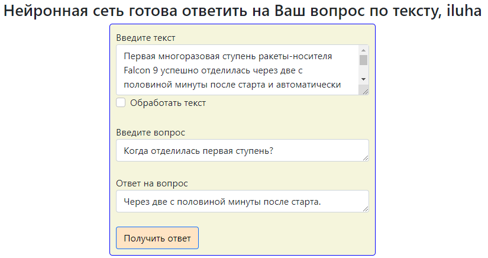

# *Question-​answering*




Разработанное приложение использует вопросно-ответную систему (*Question&Answering*), основанную на настроенной языковой модели BERT (*Fine-Tuned BERT*). Для реализации этой системы, необходимо иметь:

  - Некоторый текст, неограниченный по размеру и структуре (можно ввести свой и нажать на "обработать текст").
  - Некоторый вопрос, имеющий отношение к тексту.


Затем алгоритм обрабатывает входные текст и вопрос, и, в конечном счете, возвращает ответ на данный вопрос по
 соответствующему тексту.


# Реализация *Question&Answering* с Flask и SQLAlchemy

  Приложение написано на языке программирования **python** с использованием фреймворков **Flask** и **SQLAlchemy**. 
  Пользователь без труда может запустить программу из командной строки, и, передав соответствующие аргументы, 
  зарегистрироваться или авторизироваться.
  Подробнее ознакомиться с аргументами командной строки можно запустив программу с соответствующим ключом 
  (см. раздел **Установка и запуск**).
  Последовательность работы с программой следующая:
  - запустить файл ```server.py``` c необходимыми ключами 
  - Перейти на форму регистрации, после на форму общения с НС, либо авторизироваться и сразу перейти на форму
  - Ввести в соответствующих полях текст, вопрос (при запуске поля заполнены примерами)
  - получить результат


Также в приложении есть возможность работы с базой данных через технологию **ORM**.
Пользователь имеет возможность регистрации в БД, в котором каждая запись хранит значения 
*имени*, *почты*, хэшированного *пароля*, *даты регистрации*. 

В папке проекта есть несколько каталогов:

| Каталог | Предназначение |
| ------ | ------ |
| db | для хранения базы данных |
| orm | для хранения классов, необходимых для взаимодействия с базой данных|
| static | для хранения ресурсов проекта |
| template | для хранения шаблонов html-страниц |
| '*root*' (Flask_API) | корневой каталог, хранящий исходный код приложения, разбитый на несколько модулей|


# Предупреждения и ссылки на источники
> Информация по работе с языковыми нейронными моделями
> заимствована из открытых курсов по ai
[**Open courses on Artificial Interlligence**](https://github.com/girafe-ai).
> При первом запуске программы модель и веса загружаются из Сети,
> **убедитесь,** ****что у Вас есть выход в Интернет!****
> Загрузка происходит в каталог ```~\Users\HP\.deeppavlov```, которую в дальнейшем,
> программа использует при инициализации неронной сети.
> Также, что важно, машина, на которой запускается программа, должна быть достаточно мощной.


### Установка и запуск

Для запуска приложения с исползованием интерпретатора python рекомендуется 
использовать использовать *python 3.6.8* (*python 3.6*).
Предварительно необходимо установить все внешние библиотеки.

```$ pip install -r requirements.txt```

Также выполнить команду:

```python -m deeppavlov install squad_ru_rubert```

Запустить приложение можно в терминале c соответствующими ключами:

| Ключ | Предназначение |
| ------ | ------ |
| -h | вывод документации по аргументами командной строки |
| --first_run | указывать, если запускается программа в первый раз на 'машине'|
| --email | электронная почта пользователя |
| --password | пароль пользователя |
| --register | указывать, если необходима регистрация в базе|
| --config | файл, где указаны почта пароль пользователя (флаги *--email* и *--password* тогда не нужны)|

Например, если мы хотим авторизироваться, используя файл config в корневом каталоге, содержащий почту и пароль, достаточно 
ввести в терминале:

```python server.py --config=./config```

Для регистрации достаточно ввести:

```python server.py --register```

Также, для записи почты и пароля в файл предусмотрен скрипт settings.py.
Данный скрипт работает очень просто, чтобы разобраться, достаточно ознакомиться с кодом.